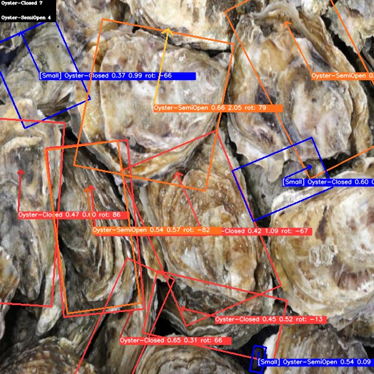

## Tutorial

## clone

**一定要clone exp分支**

```bash
git clone -b exp https://github.com/SeaCatComplexes/REU-Oyster_Orientation.git
```

## 环境安装

原来的项目环境没法用（至少在cuda驱动大于12.4的PC上），使用我导出的requirements.txt

```bash
pip install -r requirements.txt
```

python我使用的是3.9版本

## 生成模型

模型文件太大了，需要合并压缩后再解压

进入项目目录

```bash
cd weights/xlweights
```

运行如下命令

```bash
cat xlweights.* > weights.zip unzip weights.zip
```

随后解压这个zip，得到权重

## 预测

由于原版代码的函数接口出现很多无法导出的问题，因此需要对代码进行改动，修改好的都在exp分支中

运行预测

```bash
python detect.py --weights [权重路径] --source [图片路径] --conf-thres [置信度选择] --device [cpu或者是0,1的gpu编号] [--highlight-small](可选，加上这个参数可以检测出异常小生蚝)
```

## demo




